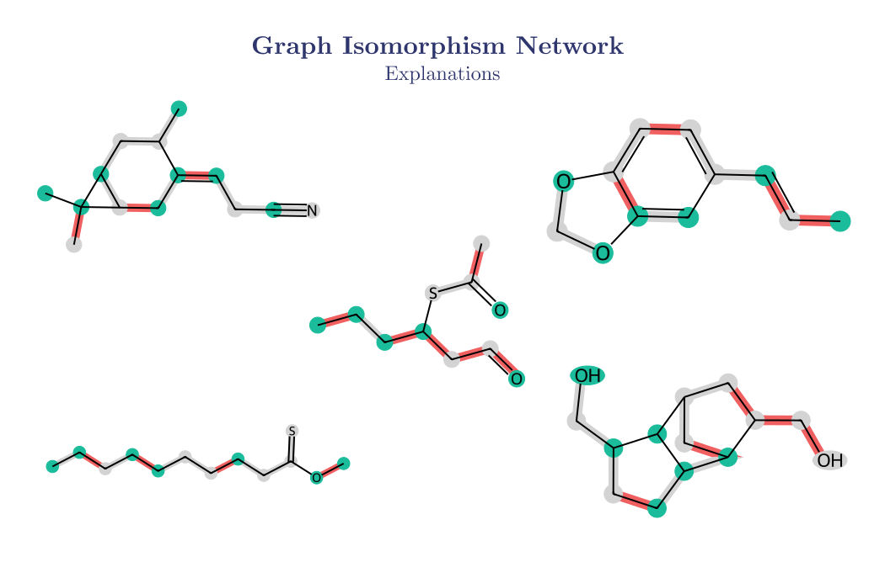
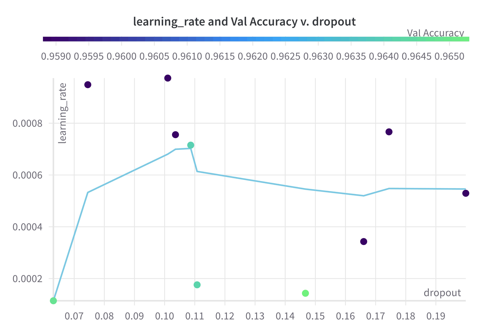
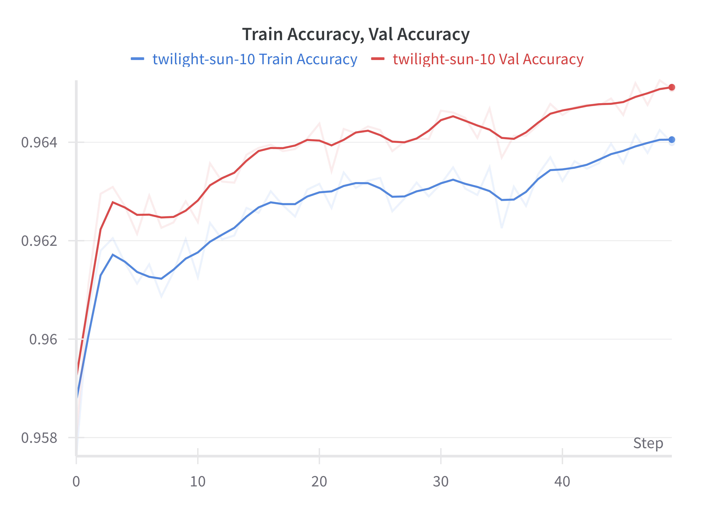

# OdourGNN
#### Deep Learning based molecule odour predictor given their chemical structure, using Graph Neural Networks



### Features
- Dataset preparation
- ML pipeline for multiclass predictions (138 classes) 
- Molecular visualization
- GNN models - GIN, GAT, GraphSAGE
- Model training & inference
- Inference Explainations
- Relative atom-bond importance visualization
- Hyperarameter tuning 
- Embedding Space visualisation

### Results 
##### Hyperparameter Tuning 
<div align="center">
 &nbsp;


</div>

##### Finetuning 
<div align="center">
 &nbsp;

</div>


### Setup Instructions
__Requirements__
```
python3 = 3.11.3
pip = 24.2
```


Run the following in terminal
```bash
git https://github.com/vansh2308/Odour-GNN.git
cd ./Odour-GNN
python3 -m venv venv 
source venv/bin/activate
pip3 install -r ./requirements.txt
```

Voila😉 Now experiment using `python3 ./main.py`


### Author
- Github - [vansh2308](https://github.com/vansh2308)
- Website - [Vansh Agarwal](https://portfolio-website-self-xi.vercel.app/)